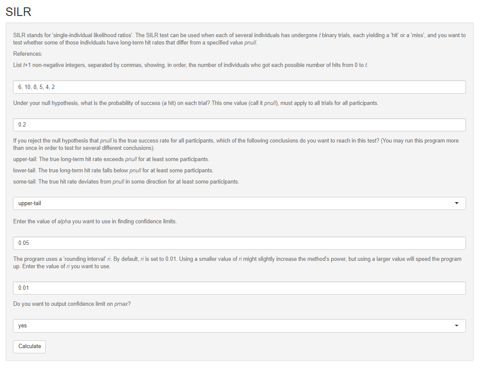

# SILR

## Description
SILR is abbreviated for single-individual likelihood ratio test, which is described in the paper: ...

This repository contains the main functions in [SILR.R](https://github.com/ZhengzeZhou/SILR/blob/master/SILR.R), and a correspongding [Shiny app](https://shiny.rstudio.com/) design in [app.R](https://github.com/ZhengzeZhou/SILR/blob/master/app.R) for easy and interactive use. 

## Installation
To use the program, there are several options:

1. For those familiar with R and Shiny, they may directly download the R scripts and run the program locally. And they could also make modifications based on specific needs.
1. To directly run the program, run "runGitHub("SILR", "ZhengzeZhou")" in the console of R studio. Here "SILR" is the repository name, and "ZhengzeZhou" is the username for Github.
1. Reviewers of the paper may directly access the Shiny program at https://zhengzez.shinyapps.io/silr/. It is emplyed by [shinyapps.io](https://www.shinyapps.io/). Please note that there is a budget limit on the total running time, and thus we will later remove this option.

## Usage
Once installed, we believe the Shiny app is very easy to use. Below is a screenshot for the input section, with default values filled in automatically. You could enter your own inputs as well. 

After click the calculate button, the program will display the output as shown below. It contains two parts: one for the input so you could check everything is correctly entered; and the other for several different output results.  
)

## Contact 

Richard B. Darlington (rbd1@cornell.edu), Department of Psychology, Cornell University.

Zhengze Zhou (zz433@cornell.edu), Department of Statistics, Cornell University.
